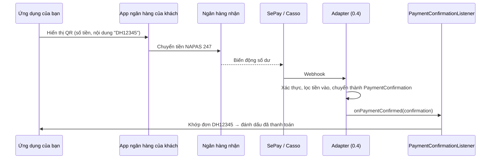

# Xác nhận thanh toán (`PaymentConfirmationListener`)

> **Trạng thái ở 0.1.0:** mới có **interface**. Chưa có adapter nào gọi listener — adapter cho SePay/Casso dự kiến ở
> 0.4 ([ROADMAP](../ROADMAP.md)). Bạn có thể viết và test listener ngay bây giờ; khi có adapter chỉ cần thêm dependency.
> Quyết định thiết kế: [ADR-0006](../adr/0006-payment-confirmation-spi.md).

## Vấn đề

Mã VietQR chỉ là dữ liệu hiển thị. Khách quét mã và chuyển tiền trong app ngân hàng của họ — ứng dụng của bạn **không
được báo** khi tiền về. Muốn tự động chuyển đơn sang "đã thanh toán", bạn cần một dịch vụ theo dõi tài khoản nhận tiền
(như SePay, Casso) gửi thông báo cho bạn.

SPI này tách phần **nhận thông báo** (adapter, khác nhau theo nhà cung cấp) khỏi phần **xử lý nghiệp vụ** (listener,
do bạn viết, không phụ thuộc nhà cung cấp).



## API

Package: `io.github.hoangluongtran0309.vietnam.vietqr.confirmation` (module `vietnam-vietqr-core`).

### `PaymentConfirmation`

| Field | Kiểu | Ý nghĩa |
|---|---|---|
| `provider` | `String`, bắt buộc | Adapter tạo ra bản ghi, ví dụ `"sepay"` |
| `transactionId` | `String`, bắt buộc | ID giao dịch phía nhà cung cấp |
| `bankBin` | `String`, có thể `null` | BIN tài khoản nhận, nếu nhà cung cấp cho biết (6 chữ số) |
| `accountNumber` | `String`, bắt buộc | Số tài khoản nhận tiền |
| `amount` | `long`, > 0 | Số tiền nhận được (VND) |
| `content` | `String`, không bao giờ `null` | Nội dung chuyển khoản **ngân hàng ghi nhận**; rỗng nếu không có |
| `occurredAt` | `Instant`, bắt buộc | Thời điểm giao dịch theo nhà cung cấp |
| `attributes` | `Map<String, String>`, bất biến | Dữ liệu riêng của nhà cung cấp, để log/tra soát |

`idempotencyKey()` trả về `provider:transactionId`.

Vi phạm ràng buộc khi tạo: thiếu field bắt buộc → `NullPointerException` (thông báo là tên field); chuỗi rỗng,
`amount ≤ 0`, `bankBin` sai định dạng → `VietQrException`.

### `PaymentConfirmationListener`

```java
@FunctionalInterface
public interface PaymentConfirmationListener {
    void onPaymentConfirmed(PaymentConfirmation confirmation);
}
```

## Hợp đồng — listener của bạn phải tuân thủ

| Quy tắc | Vì sao | Làm thế nào |
|---|---|---|
| **Idempotent** | Cùng một giao dịch có thể đến nhiều lần (nhà cung cấp gửi lại, nhiều instance) | Lưu `idempotencyKey()` với ràng buộc `UNIQUE`; đã có thì bỏ qua |
| **Chỉ nhận tiền vào** | Adapter đã lọc giao dịch tiền ra | Không cần kiểm tra chiều giao dịch |
| **Không khớp đơn là chuyện bình thường** | Khách có thể chuyển không qua QR, sửa nội dung, chuyển thiếu/thừa | Ghi lại để xử lý tay, **không** ném exception |
| **Ném exception = thất bại** | Adapter sẽ báo lỗi cho nhà cung cấp để gửi lại (nếu họ hỗ trợ) | Chỉ ném khi lỗi tạm thời (DB mất kết nối…) |
| **Chịu được gọi đồng thời** | Nhiều webhook có thể đến cùng lúc | Dựa vào ràng buộc DB, không dựa vào biến trong bộ nhớ |

## Khớp giao dịch với đơn hàng

`content` là nội dung **ngân hàng ghi nhận**, có thể khác nội dung trong QR: khách có thể sửa, một số ngân hàng thêm
tiền tố/hậu tố. Vì vậy:

- Đặt mã đơn **dễ nhận diện** trong chuỗi bất kỳ: chữ + số, không dấu cách, ví dụ `DH12345`.
- Tìm mã đơn bằng biểu thức chính quy trên nội dung đã viết hoa, **đừng so sánh bằng tuyệt đối**.
- Kiểm tra số tiền: `amount` có thể thiếu hoặc thừa so với đơn.

Ví dụ với Spring (`OrderRepository`, `ProcessedPaymentRepository`, `UnmatchedPaymentRepository` là code **của ứng dụng
bạn**, không thuộc thư viện):

```java
@Component
class OrderPaymentListener implements PaymentConfirmationListener {

    private static final Pattern ORDER_CODE = Pattern.compile("DH\\d{5}");

    private final OrderRepository orders;
    private final ProcessedPaymentRepository processed;
    private final UnmatchedPaymentRepository unmatched;

    OrderPaymentListener(OrderRepository orders, ProcessedPaymentRepository processed,
                         UnmatchedPaymentRepository unmatched) {
        this.orders = orders;
        this.processed = processed;
        this.unmatched = unmatched;
    }

    @Override
    @Transactional
    public void onPaymentConfirmed(PaymentConfirmation payment) {
        // INSERT vào bảng có UNIQUE(idempotency_key); trả false nếu đã có → giao dịch đã xử lý trước đó.
        // Cùng transaction với phần dưới: nếu xử lý lỗi, bản ghi này cũng rollback và lần gửi lại sẽ chạy lại.
        if (!processed.insertIfAbsent(payment.idempotencyKey())) {
            return;
        }

        Matcher matcher = ORDER_CODE.matcher(payment.content().toUpperCase(Locale.ROOT));
        Optional<Order> order = matcher.find() ? orders.findByCode(matcher.group()) : Optional.empty();
        if (order.isEmpty()) {
            unmatched.save(payment);          // không khớp đơn: để người xử lý
            return;
        }
        if (payment.amount() < order.get().total()) {
            order.get().markUnderpaid(payment.amount(), payment.transactionId());
        } else {
            order.get().markPaid(payment.transactionId());
        }
    }
}
```

Mã đơn trong QR nên khớp với cách listener tìm, ví dụ sinh QR bằng
`vietQr.forAmount(order.total(), order.code())` để nội dung là `DH12345`
(xem [README](README.md#nội-dung-chuyển-khoản-purpose) về giới hạn nội dung).

## Unit test listener

Không cần adapter hay nhà cung cấp — tự tạo `PaymentConfirmation`:

```java
@Test
void marksOrderPaid() {
    PaymentConfirmation payment = new PaymentConfirmation(
            "test", "TX-1", "970436", "0123456789",
            150_000, "CK 123456 DH12345 Thanh toan", Instant.now(), Map.of());

    listener.onPaymentConfirmed(payment);
    listener.onPaymentConfirmed(payment);   // gửi lại: không được xử lý hai lần

    assertThat(orders.findByCode("DH12345")).get().extracting(Order::status).isEqualTo(Status.PAID);
}
```

## Lộ trình 0.4

- Module adapter cho từng nhà cung cấp: nhận webhook, xác thực, chuyển thành `PaymentConfirmation`, gọi listener.
- Starter: controller webhook tùy chọn, gọi mọi bean `PaymentConfirmationListener`.
- Các điểm **chưa xác minh** (`TODO(v0.4)` trong ADR-0006): trường dữ liệu webhook của SePay/Casso, cách xác thực,
  cơ chế gửi lại khi listener thất bại.
